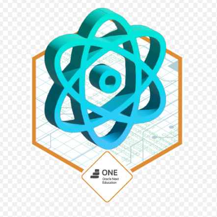

# 📽️ Aluraflix

Plataforma interativa para organizar e explorar vídeos de diferentes categorias, desenvolvida como parte do programa ONE (Oracle Next Education). O projeto é inspirado no layout do AluraFlix e implementado com React e Vite.

---

## 🌟 Funcionalidades

- Listar categorias de vídeos.
- Adicionar novos vídeos a categorias específicas.
- Editar e excluir vídeos existentes.
- Navegação fluida com design moderno.

---

## 🚀 Tecnologias Utilizadas

- **React**: Biblioteca principal para a criação de interfaces.
- **Vite**: Ferramenta de build para desenvolvimento rápido.
- **Axios**: Comunicação com API.
- **JSON Server**: Simulação de backend para armazenamento de dados.

---

## 🛠️ Pré-requisitos

Antes de iniciar, certifique-se de ter as seguintes ferramentas instaladas:

- Node.js
- Gerenciador de pacotes (npm ou yarn)

---

## 🚀 Como Rodar o Projeto

1. **Clone este repositório:**

```bash
https://github.com/seu-usuario/aluraflix.git
```

2. **Instale as dependências:**

```bash
npm install
```

3. **Inicie o servidor de desenvolvimento:**

```bash
npm run dev
```

4. **Inicie o servidor JSON:**

```bash
npx json-server --watch db.json --port 3000
```

5. **Acesse o projeto no navegador:**

- Abra o navegador e vá para: `http://localhost:5173`

---

## 📂 Estrutura do Projeto

```
├── public/              # Arquivos públicos
├── src/
│   ├── assets/
│   │   ├── Logo.svg
│   ├── components/      # Componentes reutilizáveis
│   │   ├── banner
│   │     ├── Banner.css
│   │     ├── Banner.jsx
│   │   ├── card
│   │     ├── Card.css
│   │     ├── Card.jsx
│   │   ├── category
│   │     ├── Category.css
│   │     ├── Categoria.jsx
│   │   ├── footer
│   │     ├── Footer.css
│   │     ├── Footer.jsx
│   │   ├── header
│   │     ├── Header.css
│   │     ├── Header.jsx
│   │   ├── modal
│   │     ├── Modal.css
│   │     ├── Modal.jsx
│   │   ├── videocard
│   │     ├── VideoCard.css
│   │     └── VideoCard.jsx
│   ├── pages/           # Páginas principais
│   │   ├── FormPage.jsx
│   │   ├── FormPage.css
│   │   ├── Home.jsx
│   │   ├── HomePage.jsx
│   │   ├── HomePage.css
│   │   └── NewVideo.jsx
│   │   ├── App.jsx
│   │   ├── App.css
│   │   ├── Footer.jsx
│   │   ├── Footer.css
│   │   ├── Global.css
│   │   ├── Header.jsx
│   │   ├── Header.css
│   │   └── Main.jsx     # Ponto de entrada do React
├── db.json              # Banco de dados fake
├── index.html           # Estrutura inicial do projeto
├── package.json         # Gerenciamento de dependências
├── vite.config.js       # Configuração do Vite
└── README.md            # Documentação do projeto
```

---

## 📌 Páginas do Projeto

- **Home:** Página inicial com listagem de categorias e vídeos.
- **Novo Vídeo:** Formulário para adicionar novos vídeos.
- **Editar Vídeo:** Modal para edição de vídeos.

---

## 🎨 Layout

O layout segue as diretrizes do AluraFlix, com design moderno e responsivo.

---

## 📝 Licença

Este projeto está licenciado sob a licença MIT. Consulte o arquivo LICENSE para mais detalhes.

---

## 👩‍💻 Desenvolvido por

Thaís Bezerra

[LinkedIn](https://www.linkedin.com/in/thaisbezerra/) | [GitHub](https://github.com/sweetcarolaine)

---

### 🏆 Badge do Projeto

